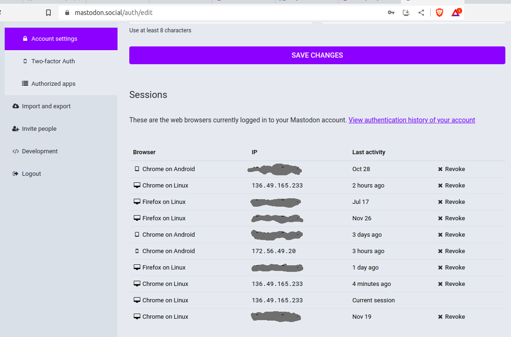

<!SLIDE bullets incremental>
# Security
* [EFF: Is Mastodon Private and Secure? Let’s Take a Look](https://www.eff.org/deeplinks/2022/11/mastodon-private-and-secure-lets-take-look)
* [Mastodon HTTP Signatures](https://docs.joinmastodon.org/spec/security/#http)
* [How to implement a basic ActivityPub server](https://blog.joinmastodon.org/2018/06/how-to-implement-a-basic-activitypub-server/)
* [How to make friends and verify requests](https://blog.joinmastodon.org/2018/07/how-to-make-friends-and-verify-requests/)
* Digest of document needs to be included in the signature!
* [Content Security Policy](https://github.com/mastodon/mastodon/blob/main/config/initializers/content_security_policy.rb)
* Direct Messages should not be considered private

<!SLIDE center>

<!SLIDE bullets>
# Security: rel=me verification
* [Setting up your profile](https://docs.joinmastodon.org/user/profile/)
* A malicious mastodon instance can forge verification checkmark
